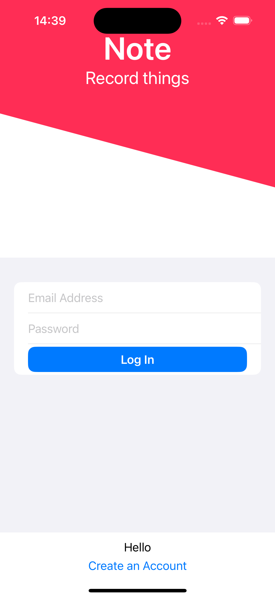
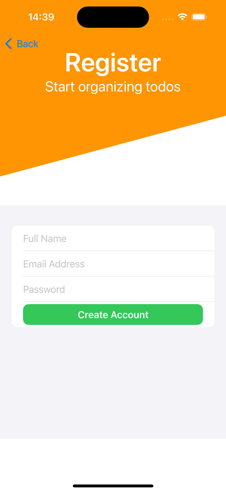
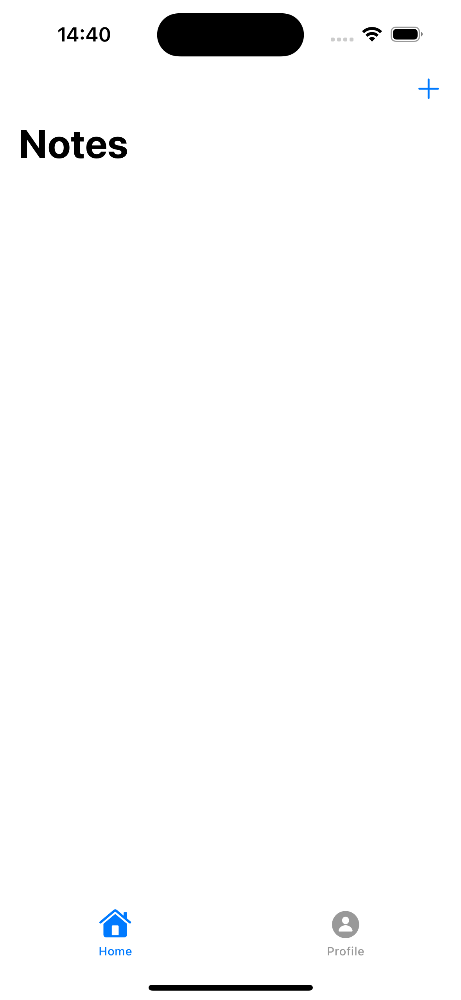
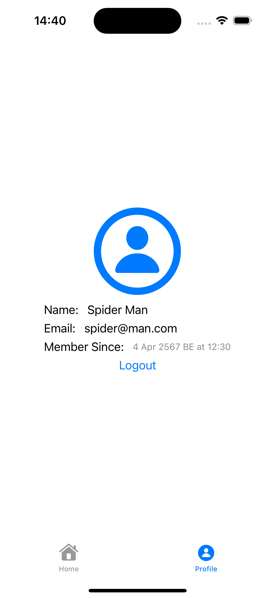
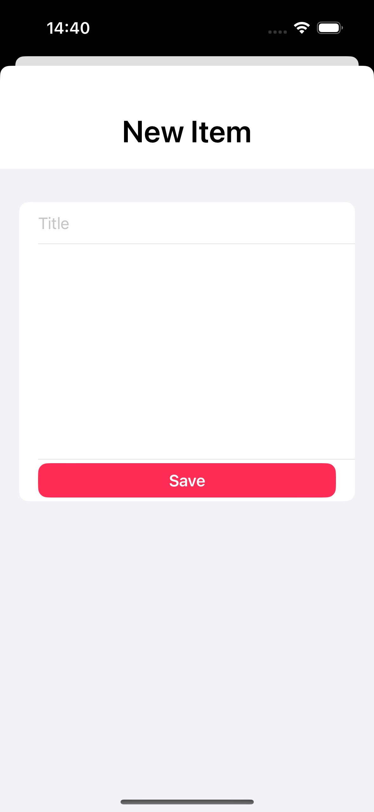
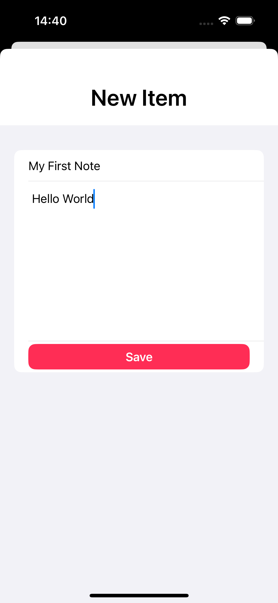
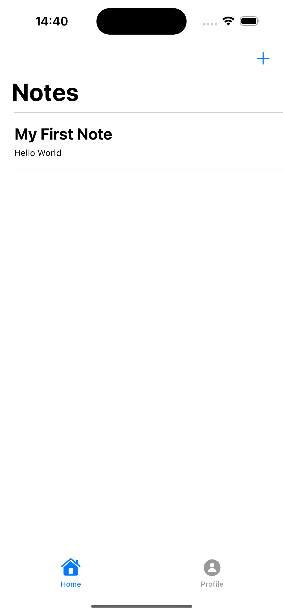
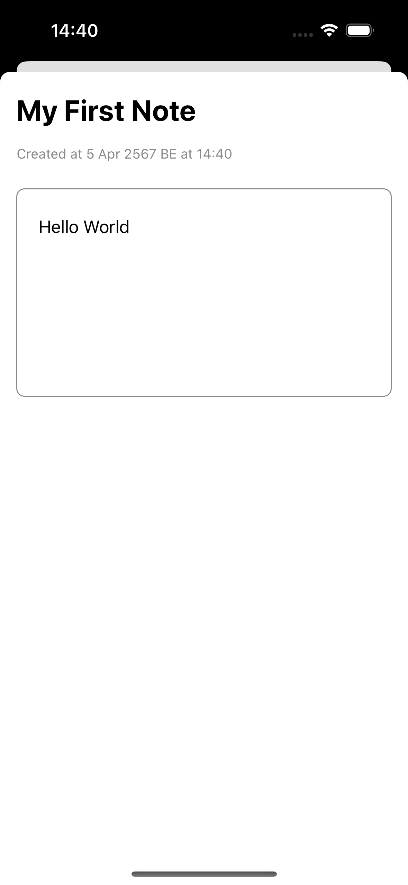
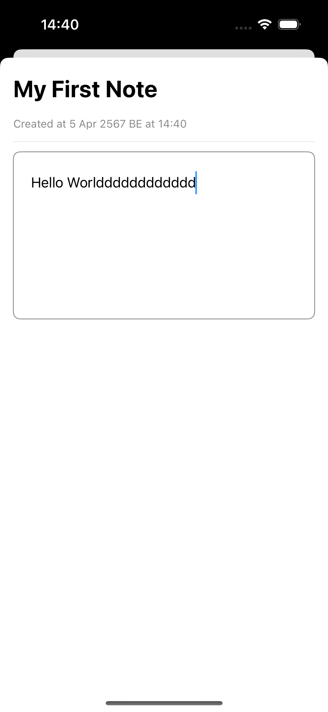

6410685033 Thammasat Thonggamgaew

# CN436_AS4: Note App

An iOS Note App 
[Demo Clip](https://youtu.be/-SKyd_fC4k4)

## Table of Contents
- [Table of Contents](#table-of-contents)
- [Objective](#objective)
- [Features](#features)
- [Screenshots](#screenshots)
- [Contact](#contact)

## Objective
Provide a simple and user-friendly platform for users to create, edit, and manage their notes.

## Features
- Create, edit, and delete notes.
- Firebase Database.
- SwiftUI.

## Screenshots

### Contact
- Thammasat Thonggamgaew (Pond)
- Tel: (+66) 087 704 4428
- Email: pond.thammasat@gmail.com
- University Email: thammasat.tho@dome.tu.ac.th
- Faculty Email: 6410685033@student.tu.ac.th
